# Azure-Certification-DP-200

Various modules and percentage involved in DP-200.

1) Data Storage - (20-30%)

2) Data Processing - (30-35%)
	- BigData Implementation
	- Developing Batch and Streaming solution
	- Integration solution
	- Implement Migration
	- Automate Datafactory pipelines

3) Data Security - (15-20%)
	- Managing source
	- Managing and configuring Data Authentication
	- Manage data policies and standards
	- Alerts

4) Monitoring Data Solutions - (10-15%)
	- Monitoring Data storing 
	- Database 
	- Data Processing

5) Troubleshooting Azure services - (10 - 15%)

## Exam Pattern

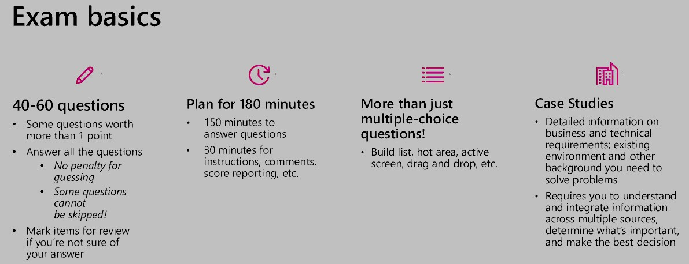

- Duration: 210 min

- Multiple choice questions around 60 including Lab consisting of around 10 small tasks to be performed on Azure Portal.

- Questions would come focusing the “skills measured” topics in the [DP-200](https://www.microsoft.com/en-us/learning/exam-dp-200.aspx)

- Typical questions would test the selection of Azure services for a given case study and also sequence of steps involved in implementing a solution like ingesting data from ADLS to SQL DW using polybase

- 7 MCP mandatory questions. (Cannot go back after selecting one answer)

- Case Study
	- Entire business and technical requirement

- Mixed Questions
	- Drag and drop

## Type of Data

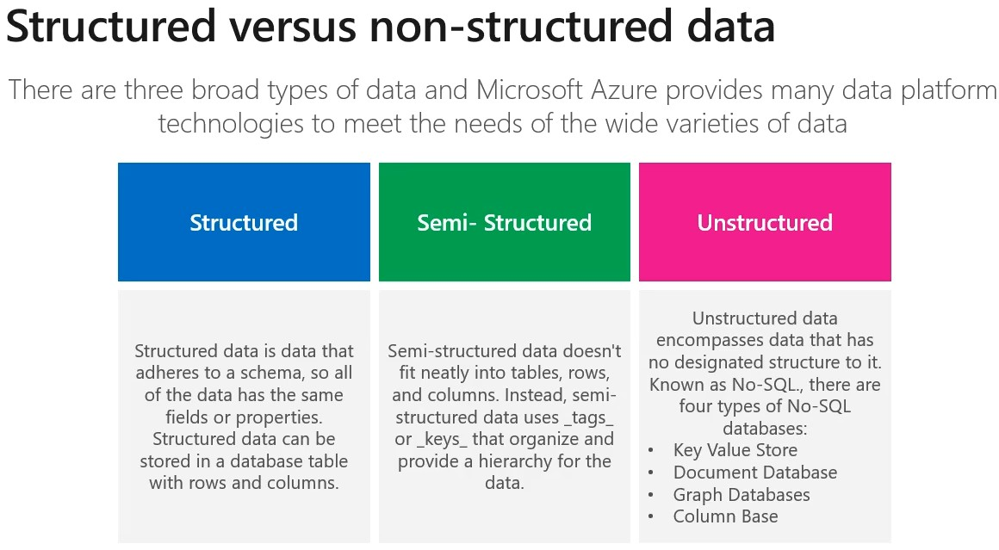

## Azure Storage

4 configurations options available includes

1) Azure Blob
	- Massive storage for Text and binary
  
2) Azure Files
    - Mange files or share for cloud or on premise deployment
    
3) Azure Queues
    - Messaging store for reliable messaging between application components
    
4) Azure Tables
    - A noSql stores for schemaless storage of structured data

Performance: 
- Standard allows you to have any data service (Blob, File, Queue, Table) and uses magnetic disk drives. 
- Premium limits you to one specific type of blob called a page blob and uses solid-state drives (SSD) for storage.

Access tier: 
- Hot
	- When the data is retrieved frequently
- Cold
	- When the data is not often accessed.

**Note:** 

- Data Lake Storage(ADLS) Gen2 can be enabled in the Azure Storage. Heirarchical Namespace: 
	- The ADLS Gen2 hierarchical namespace accelerates big data analytics workloads and enables file-level access control lists (ACLs)
- Account kind: StorageV2 (general purpose v2) 
	- The current offering that supports all storage types and all of the latest features	
- A storage account is a container that groups a set of Azure Storage services together.

**Azure Blob Usage**
  - When we don’t have to query on the data stored
  - Less cost
  - Works well with images and unstructured format


## What service to use for Data?

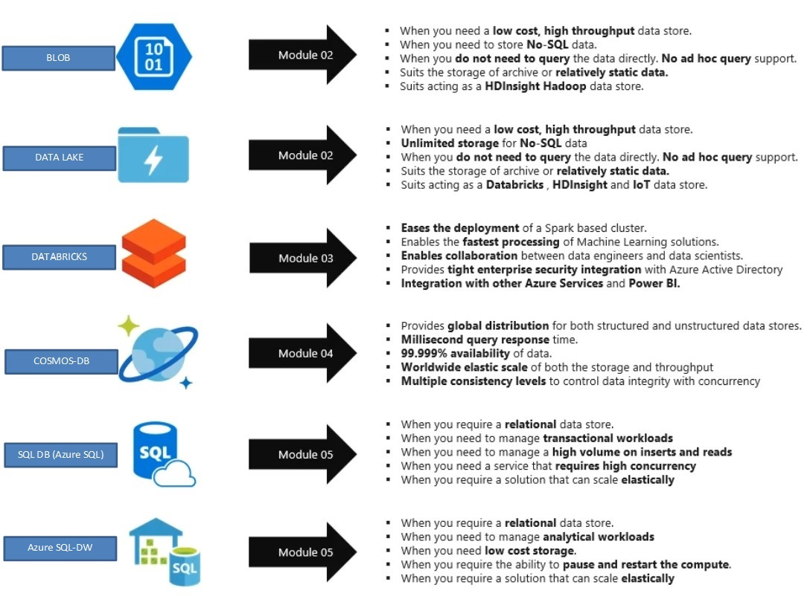

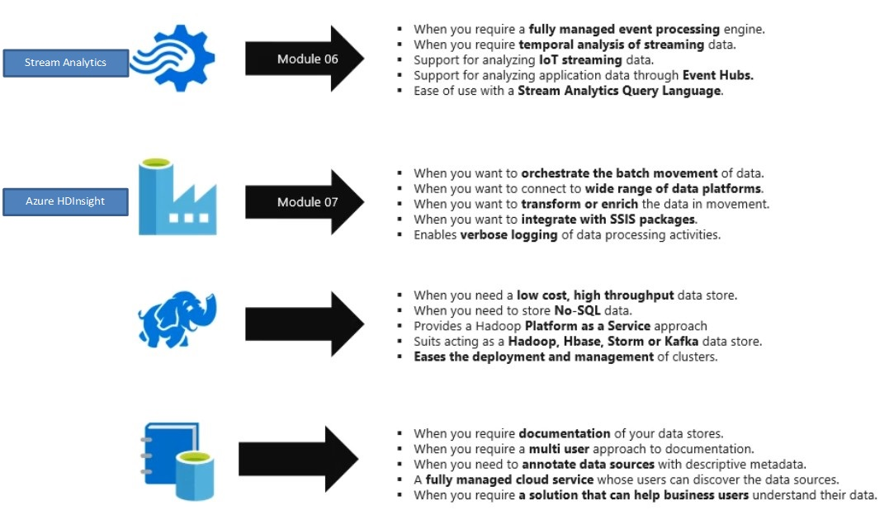


## Architecture and usage of different Azure services

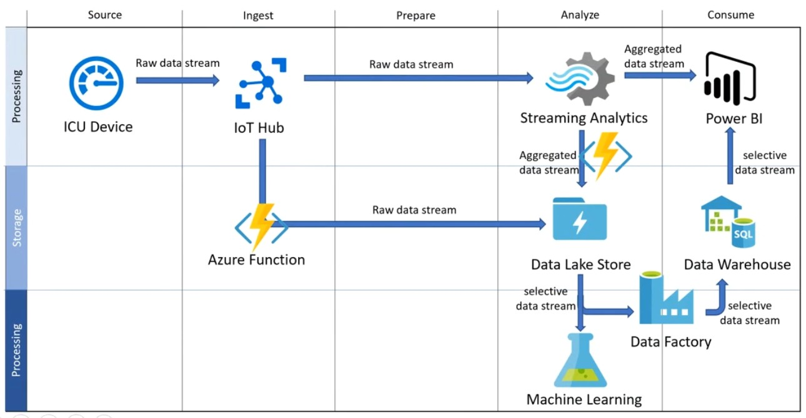

## Azure Databricks

- Apache Spark-based analytics platform
	- Simplifies the provisioning and collaboration of Apache Spark-based analytical solutions

- Enterprise Security
	- Utilizes the security capabilities of Azure
	
- Integration with other Cloud Services
	- Can integrate with variety of Azure data platform services and Power BI
	
## Azure HD-Insight

- Deploy cluster of Hadoop or Storm or Spark

## Azure Active Directory

- To guarantee security and manage person.
- Role  and user permission to Databricks and data lake.

## Reading Data in Azure Databricks

| SQL | DataFrame |
| :---: | :---: |
| SELECT col_1 FROM myTable | df.select(col("col_1")) |
| DESCRIBE myTable | df.printSchema() |
| SELECT * FROM myTable WHERE col_1 > 0 | df.filter(col("col_1") > 0) |
| ..GROUP BY col_2 | ..groupBy(col("col_2")) |
| ..ORDER BY col_2 | ..orderBy(col("col_2")) |
| ..WHERE year(col_3) > 1990 | ..filter(year(col("col_3"))) > 1990) |
| SELECT * FROM myTable LIMIT 10 | df.limit(10) |
| display(myTable)(text format) | df.show() |
| display(myTable)(html format) | display(df) |

## Performing ETL to populate a data model

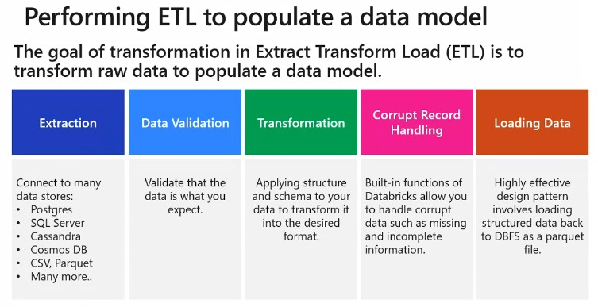

## Transformations usually performed on a dataset

- Basic Transformations
	- Normalizing values
	- Missing/Null data
	- De-duplication
	- Pivoting Dataframes

- Advanced Transformations
	- User Defined functions
	- Joins and lookup tables
	- Multiple databases

## COSMOS-DB

Can Build Globally Distributed Databases with Cosmos DB, it can handle
- Document databases
- Key value stores
- Column family stores
- Graph databases

Azure Cosmos DB indexes every field by default

Azure Cosmos DB (NOSql)
- Scalability
- Performance
- Availability
- Programming Models 

## Request Units in Cosmos-DB

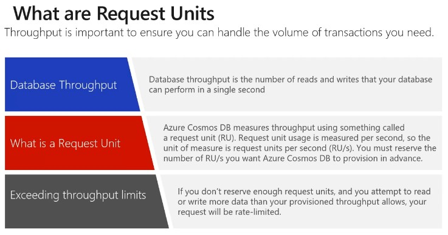

Request Unit (RU) for a DB
- A single RU is equivalent to 1 KB of Get request
- Creation, deletion and insertion require additional processing costing more RU.
- RU can be changed at any point of time
- Value of RU can be set via [Capacity Planner](www.documentdb.com/capacityplanner)
	- Upload the sample JSON doc
	- Define no of documents
	- Minimum RU =  400
	- Maximum RU =  215 thousand (If we require more throughput then a ticket needs to raised in the Azure portal for it)

## Choosing Partition-Key

- Enable quick lookup of data
- Enable it to Autoscale when needed
- selection of right partition key is important during development process
- Partition key is the value used to organise your data into Logical divisions.
	- eg: In a Retail scenario
		- ProductID and UserID value as a partition key is a good choice.

Note:
 A physical node can have 10 GB of information that means each Unique partition Key can have 10 GB of unique values.
 
 
### Creating a Cosmos-DB

1. Click on resources and create it
2. Click on Data Explorer to create a Database name and the table
3. Use New Item tab to add the values to the table 
4. UDF can also be created as Stored procedures in Javascript.

We can also create the same using Azure CLI

```
az account list —output table	// Lists the set of Azure subscriptions that we have

Az account set —subscription “<subscription name>”

az  group list —out table	// List of resource groups 

export NAME=“<Azure Cosmos DB account name>”

export RESOURCE_GROUP=“<rgn>[sandbox resource group name]</rgn>”

Export LOCATION=“<location>”	// Data centre location

Export DB_NAME=“Products”

Az group create —name <name> —location <location>

Az cosmosdb create —name $NAME —kind GlobalDocumentDB —resource-group $RESOURCE_GROUP

Az cosmosdb database create —name $NAME —db-name $DB_NAME —resource-group $RESOURCE_GROUP

Az cosmosdb collection create —collection-name “Clothing“ —partition-key-path “/productId” —throughput 1000 - name $NAME —db-name $DB_NAME —resource-group $RESOURCE_GROUP
```

#### After creating a COSMOSDB
- Navigate to Data Explorer
- Click on New container and Database
- A container can have multiple Databases


## Cosmos DB fail over management

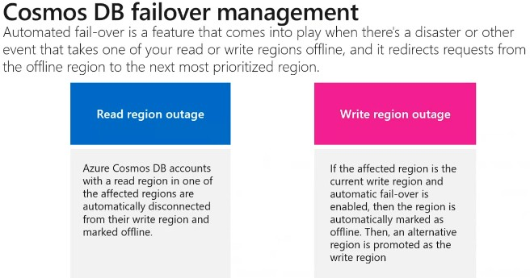

## Cosmos DB Consistency Levels

| Consistency Level | Guarantees |
| :---: | :---: |
| Strong | Linearizability. Reads are guaranteed to return the most recent version of an item |
| Bounded Staleness | ConsistentPrefix. Reads lag behind writesby at most k prefixes or t interval. |
| Session | Consisten Prefix. Monotonic reads, monotonic writes, read-your-writes, write-follows-reads. |
| Consistent Prefix | Updates returned are some prefix of all the updates, with no gaps. |
| Eventual | Out of order reads. |

- Eventual consistency provide the weakest read consistency but offer lowest latency of both reads and writes. :bangbang: :triangular_flag_on_post:

Question related to setting up latency :bangbang: :triangular_flag_on_post:

What is the Latency I will have to use in order to provide the lower latency of reads and writes  :bangbang: :triangular_flag_on_post:
	- Eventual Consistency

 COSMOS-DB takes care of consistency of data when replicated  :bangbang: :triangular_flag_on_post:

## AZURE SQL DATABASE CONFIGURATION

- DTUs (Database Transaction Unit)
	- Combined measure of Compute, storage, and IO resources
- VCores
	- Enables you to configure resources independently
	- Greater control over compute and storage resources 
- SQL Elastic Pools
	- Relate to eDTUs.
	- Enable you to buy set of compute and storage resources that are shared among all the databases in the pool.	
	- Each database can use the resources they need.
- SQL Managed Instances
	- Creates a database with near 100% compatibility with the latest SQL server.
	- Useful for SQL Server  customers who would like t migrate on-premises servers instance in a “lift and shift” manner.

### shell.azure.com to start Azure shell

```
To connect to Database
jay@Azure:~$ az configure --defaults group=ms-dp-200 sql-server=jaysql01

jay@Azure:~$ az sql db list
O/P:
	

jay@Azure:~$ az sql db list | jq '[.[] | {name: .name}]'
O/P:
[
  {
    "name": "master"
  },
  {
    "name": "sqldbjay01"
  }
]

jay@Azure:~$ az sql db show --name sqldbjay01

az sql db show-connection-string --client sqlcmd --name sqldbjay01
O/P:
	"sqlcmd -S tcp:<servername>.database.windows.net,1433 -d sqldbjay01 -U <username> -P <password> -N -l 30"

"sqlcmd -S tcp:sqldbjay01.database.windows.net,1433 -d sqldbjay01 -U jay -P “******” -N -l 30"

SELECT name FEOM sys.tables; GO
```

SQL-DB does not take care of consistency of data when replicated, it needs to be done manually. :bangbang: :triangular_flag_on_post:

 ## SQL ELASTIC POOLS :bangbang: :triangular_flag_on_post:
 
 
## AZURE SQL-DW

#### 3 types

- Enterprise DW
    - Centralized data store that provides analytics and decision support
- Data Marts
    - Designed for the needs of a single Team or business unit such as sales
- Operational Data Stores
    - Used as interim store to integrate real-time data from multiple sources for additional operations on the data.

#### 2 Architectural way of building a DW

-  Bottom-Up Architecture
    - Approach based on the notion of connected Data Marts
    - Depends on Star Schema
    - Benefit
        - Start departmental Data Mart
	
- Top-down Architecture
    - Creating one single integrated Normalized Warehouse
    - Internal relational constructs follow the rules of normalization

#### Azure SQL-DW Advantage

- Elastic scale & performance
    - Scales to petabytes of data
    - Massively Parallel Processing
    - Instant-on compute scales in seconds
    - Query Relational / Non-Relational
    
- Powered by the Cloud
    - Starts in minutes
    - Integrated with AzureML, PowerBI & ADF
    - Enterprise Ready

	
#### Azure-DW GEN-2
- Introduced Cache and tempDB to pull data from remote datasets 
- Max DWU is 30Kc
- 120 connections and 128 queries
- MPP

#### Creation of Azure DW
- Create New resource 
- DB 
- SQL Data Warehouse

Using PolyBase to Load Data in Azure SQL Data Warehouse :bangbang: :triangular_flag_on_post:

#### How PolyBase works  :bangbang: :triangular_flag_on_post:

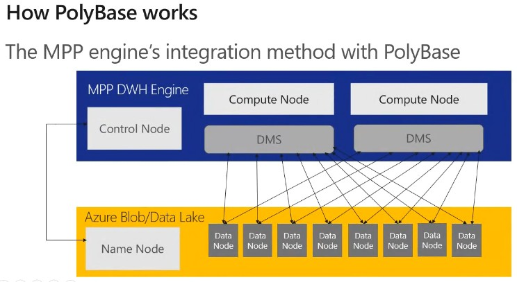

The MPP engine’s integration method with PolyBase

- Azure SQLDW is a relational datawarehose store which use MPP architecture which takes advantage of the on demand Elastic scale of Azure compute and storage to load and process Petabytes of data
- Transfers data between SQLDW and external resource providing the fast performance
- Faster way to access Data Nodes

PolyBase ETL for DW are
- Extract the source data into Text file
- Load the data into Azure Blob Storage / Hadoop DataLake store
- Import the data into SQLDW staging table using PolyBase
- Transform the data (optional state)
- Insert the data into Partition tables

## Create a Storage Account
	- Go to Resource
Blobs
- REST-based object storage for Unstructured data.

#### Import the Blob file into SQL-DW

```
CREATE MASTER KEY;
CREATE DATABASE SCOPED CREDENTIAL AzureStorageCredential
WITH
	IDENTITY = ‘jayDW’,
	SECRET = ‘THE-VALUE-OF-THE-ACCESS-KEY’		-- put key1’s value here
;

CREATE EXTERNAL DATA SOURCE AzureStorage
WITH (
TYPE = HADOOP ,
LOCATION = ‘wasbs://data-files@demodwstorage.blob.core.windows.net‘,
CREDENTIAL = AzureStorageCredential
);

CREATE EXTERNAL FILE FORMAT TextFile
WITH (
 FORMAT_TYPE = DelimiteddText,
FORMAT_OPTIONS (FIELD_TERMINATOR = ‘,’)
);

— Load the data from Azure Blob storage to SQL Data Warehouse

CREATE TABLE [dbo].[StageDate]
WITH (
CLUSTERED COLUMNSTORE INDEX,
DISTRIBUTION = ROUND_ROBIN
)
AS
SELECT * FOM [dbo].[Temp];

— Create statistics on the new data

CREATE STATISTICS [DataKey] on [StageDate] ([DateKey]);
CREATE STATISTICS [Quarter] on [StageDate] ([DateKey]);
CREATE STATISTICS [Month] on [StageDate] ([Month]); 

```

#### Import the Blob file into SQL-DW (Alternative)

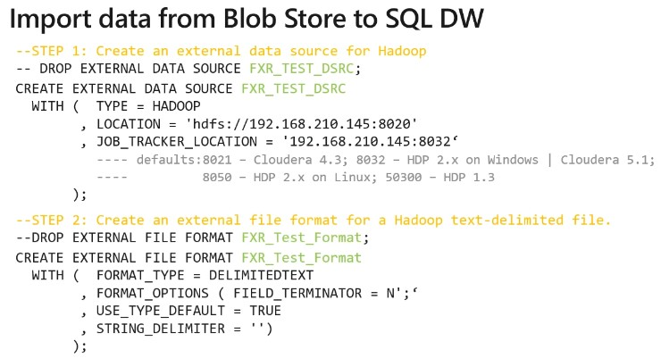
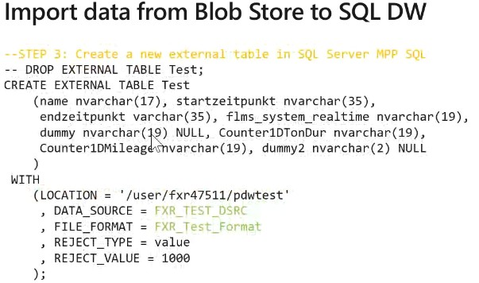
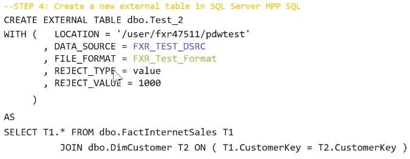

#### Check Ingest Polybase in Datawarehouse :bangbang: :triangular_flag_on_post:

## Data Streams

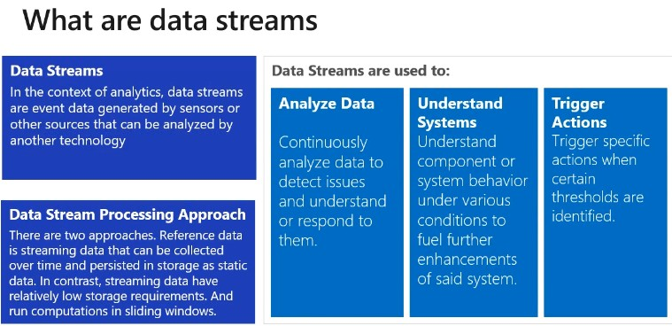

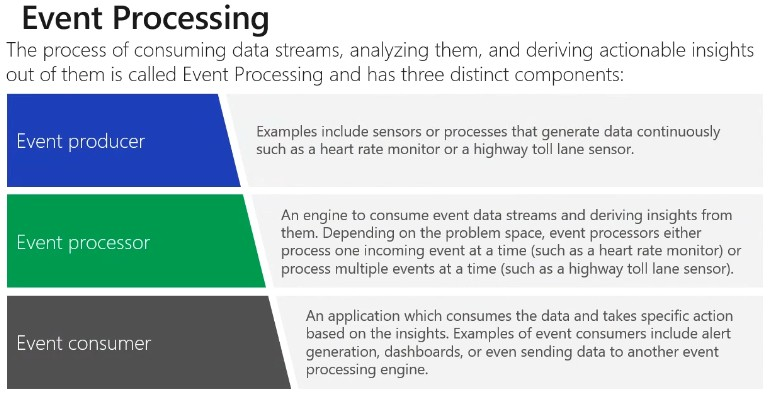

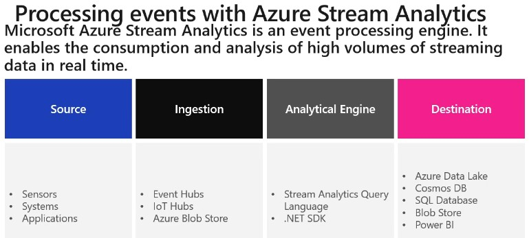

## ORCHESTRATING DATA MOVEMENT WITH ADF AND SECURING AZURE DATA PLATFORMS

### Azure Event Hubs:
- Is a highly scalable publish-subscribe service that can ingest millions of events per second and stream them into multiple applications
- A Event hub is a cloud-based event service capable of receiving and assessing millions of events per second.
- An Event is a small packet of information, a datagram that contain a notification.
- Events can be published individually or in batch.
- Single Publication or batch count can exceed 256KB.

### Create Event Hub
- Navigate to Entities 
- Event Hub
- Shared Access policies
	- Policy will generate Primary key and Secondary key and the connection string

### Configure Application to use Event Hubs

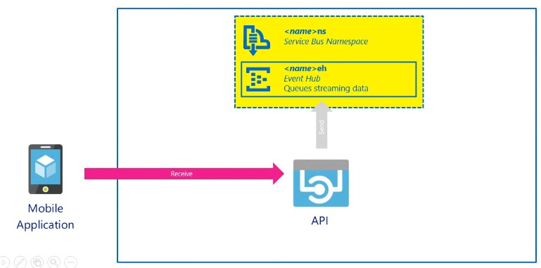

### Azure Stream Analytics Workflow

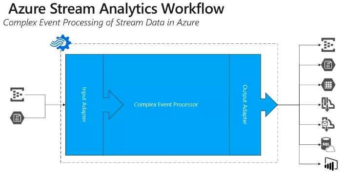

## Azure Data Factory - ADF
- Creates, orchestrates, and automates the movement, transformation and/or analysis of data through in the cloud.
 
#### The Data Factory Process
- Connect & collect
- Transform & Enrich
- Publish
- Monitor

## Azure Data Factory Components

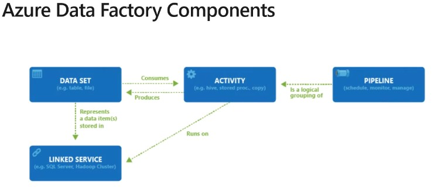

## Azure Data Factory Contributor Role
- Create, edit, and delete factories and child resources including datasets, linked services, pipelines, triggers, and integration runtimes.
- Deploy Resource Manager templates. Resource Manager deployment is the deployment method used by Data Factory in the Azure portal.
- Manage App Insights alerts for a data factory
- At the resource group level or above, lets users deploy Resource Manager template.
- Create support tickets.

#### Linked Services


#### Linked Service Example

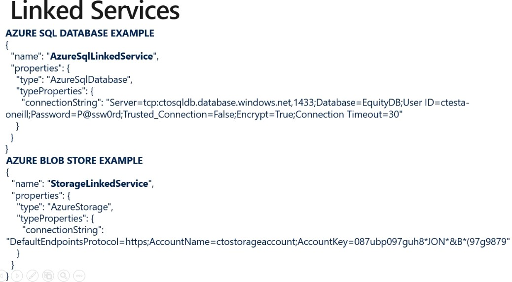

#### DataSets

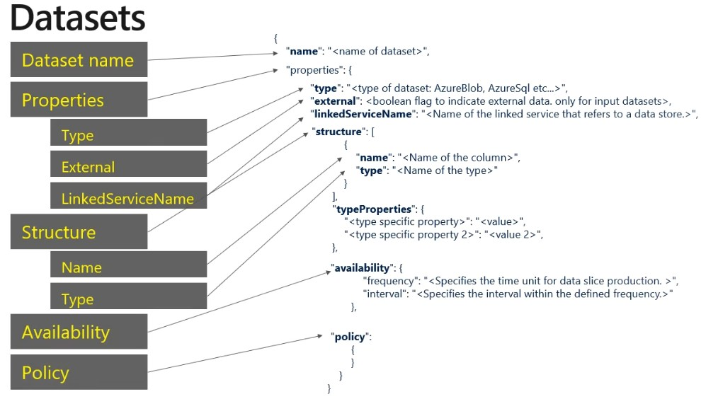

#### Time Slicing Data

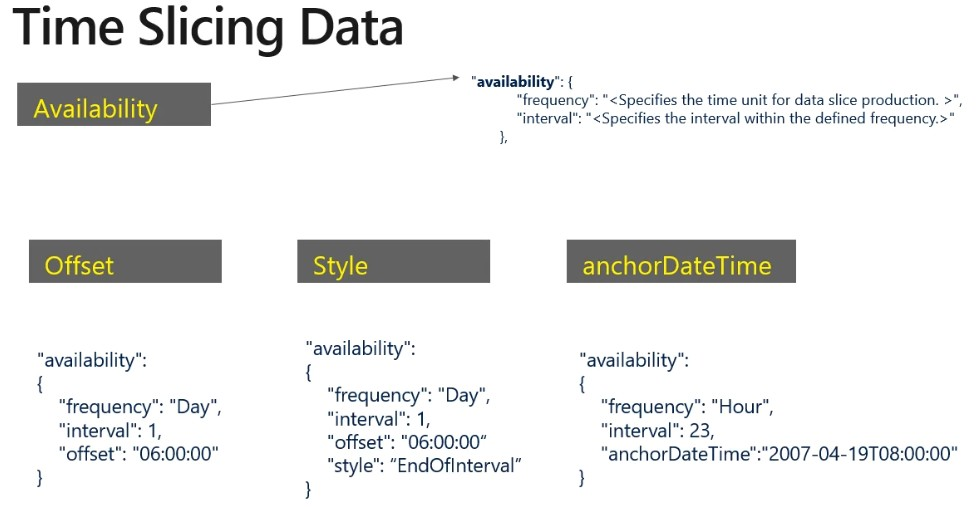

### Data Factory Activities
Activities within ADF defines the actions that will be performed on the data and there are three categories including:
- Data movement activities
	- Simply move data from one data store to another.
	- A common example of this is in using Copy Activity.
- Data transformation activites
	- Use compute resource to change or enhancedata through transformation, or it can call a compute resource to perform an analysis of the data
- Control Activities
	- Orchestrate pipeline activities that includes chaining activities in a sequence, branching, defining parameters at the pipeline level, and passing arguments while invoking the pipeline on-demand or from a trigger
	
### Pipelines
- Pipeline is a grouping of logically related activities.
- Pipeline can be scheduled so the activities within it get executed.
- Pipeline can be managed and monitored.

### Working with documents programmatically
- Create Storage Account
- Create ADF
- Create data workflow pipeline
- Add Databricks workbook to pipeline
- Perform analysis on the data

### Network Security

Securing your network from attacks and unauthorized access is an important part of any architecture.

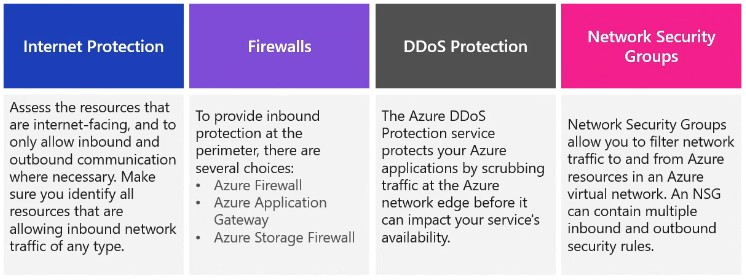

### Identity and Access (Azure Active Directory (AD))

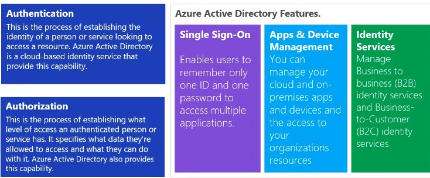

### Encryption

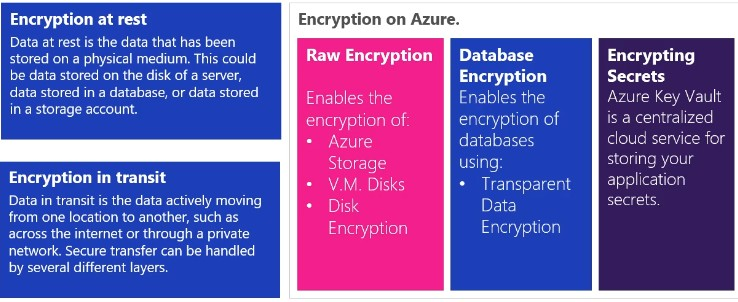

### Azure Key-Vaults (2 Ques) :bangbang: :triangular_flag_on_post:

- It is a centralised cloud service for storing your application secrets
- Provides secure access capability
- Key management can be done

#### Different Keys available
- RSA
- EC

### Managing Encryption

Databases stores information that is sensititve, such as physical address, email address, and phone numbers. The following is used to protect this data:

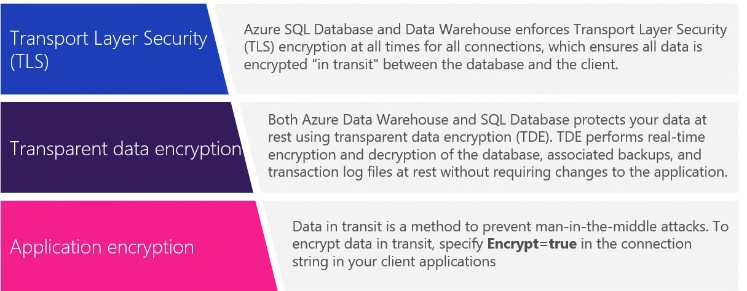

### Azure Data Lake Storage Gen2 Security Features

- Role Based Access Control
- Posix Complaint ACL
- AAD Oauth 2.0 Token
- Azure Services Integration

## MONITORING, TROUBLESHOOTING DATA STORAGE AND OPTIMIZING DATA PLATFORMS

### Azure Monitor

Azure Monitor provides a holistic monitoring approach by collecting, analyzing, and acting on telemetry from both cloud and on-premises environments

#### Metric Data
- Provides quantifiable information about a system over time that enables you to observe the behavior of a system.

#### Log Data
- Logs can be queried and even analyzed using Log Analytics. In addition, this information is typically presented in the overview page of an Azure Resource in the Azure portal.

#### Alerts
- Alerts notify you of critical conditions and potentially take corrective automated actions baed on triggers from metrics or logs.

### Monitoring the network
Log Analytics within Azure monitor has the capability to monitor and measure network activity.

#### Network Performance Monitor
- Measures the performace and reachability of the networks that you have configured.

#### Application Gateway Analytics
- Contains rich, out-of-the box views you can get insights into key scenarios, including:
	- Monitor client and server errors.
	- Check requests per hour

### Connectivity Issues

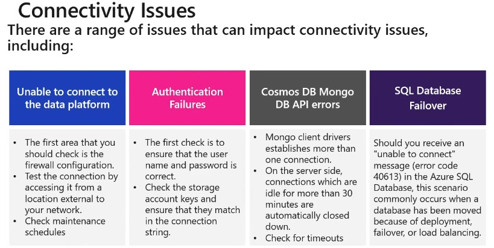

### Performance Issues (To speed up query performance)

- Data Lake Storage
	- Ensure heirarchical Namespace is enabled

- SQL Database
	- Install the latest Docment-DB SDK
	- Use Direct mode as your connection mode  when configuring your connection policy.
	- Increase the no of thread or tasks to decrease the wait time while fulfilling the requests.
	- Identify and add missing indexes.
	
- Cosmos DB
	- Avoid full scans on the collection, so query part of the collections
	- All UDF's and built-in function will scan across all the documents within the query
	- Use Direct mode as your connection mode  when configuring your connection policy.
	- Tune the page size for querying and read feeds for better performance using the x-ms-max-itime.count.header
	- For any partisient collections query in parallel to increase performance and leverage more throughput
	- Use direct https connectivity mode for best performance
	
- Colocation of Resources
	- Try increasing the RU between your collection

- SQL Data Warehouse
	- Ensure the statistics are up-to-date
	- Query optimizer

### Storage Issues  :bangbang: :triangular_flag_on_post:
- Consistency
- Corruption

### Troubleshoot Streaming data

When using Stream Analytics, a Job encapsulates the stream Analytic work and is made up of three components:

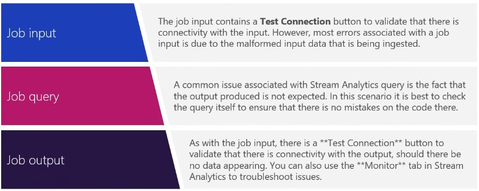

### Troubleshoot batch data loads

When trying to resolve data load issues, it is forst pragmatic to make the holistic checks on Azure, as well as the network checks and diagnose and solve the issue check. After that, then check:

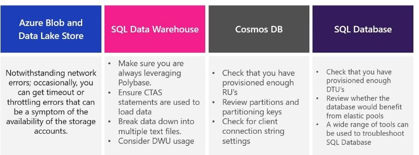

### Data redundancy

Data redundancy is the process of storing data in multiple locations to ensure that it is highly available.

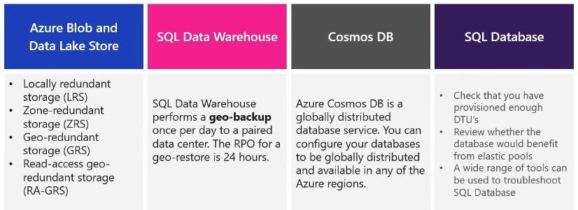

### Disaster Recovery

There should be process that are involved in backing up or preoviding failover for databases in an Azure data platform technology. Depending on circumstances, there are numerous approaches that can be adopted.

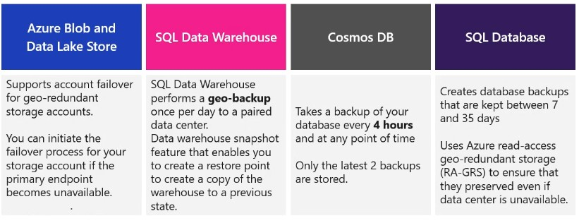

## Scenario's

1. **Recommended service: Azure Cosmos-DB**

- Semi-structured: because of the need to extend or modify the schema for new product
- Azure Cosmos DB indexes every field by default
- ACID-compliant and faster while querying compared to other services

Advantages:

- Latency & throughput: High throughput and low latency
- Transactional support: Required
- Customers require a high number of read operations, with the ability to query on many fields within the database.
- The business requires a high number of write operations to track the constantly changing inventory.

2. **Recommended service: Azure Blob storage**

 - Unstructured: Product catalog data

- Only need to be retrieved by ID.
- Customers require a high number of read operations with low latency.
- Creates and updates will be somewhat infrequent and can have higher latency than read operations.
- Latency & throughput: Retrievals by ID need to support low latency and high throughput. Creates and updates can have higher latency than read operations.
- Transactional support: Not required

3. **Recommended service: Azure SQL Database**

- Structured: Business data
- Operations: Read-only, complex analytical queries across multiple databases
- Latency & throughput: Some latency in the results is expected based on the complex nature of the queries.
- Transactional support: Required
